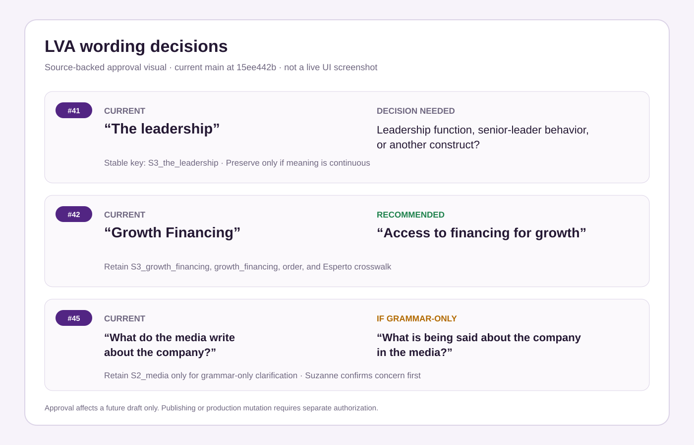
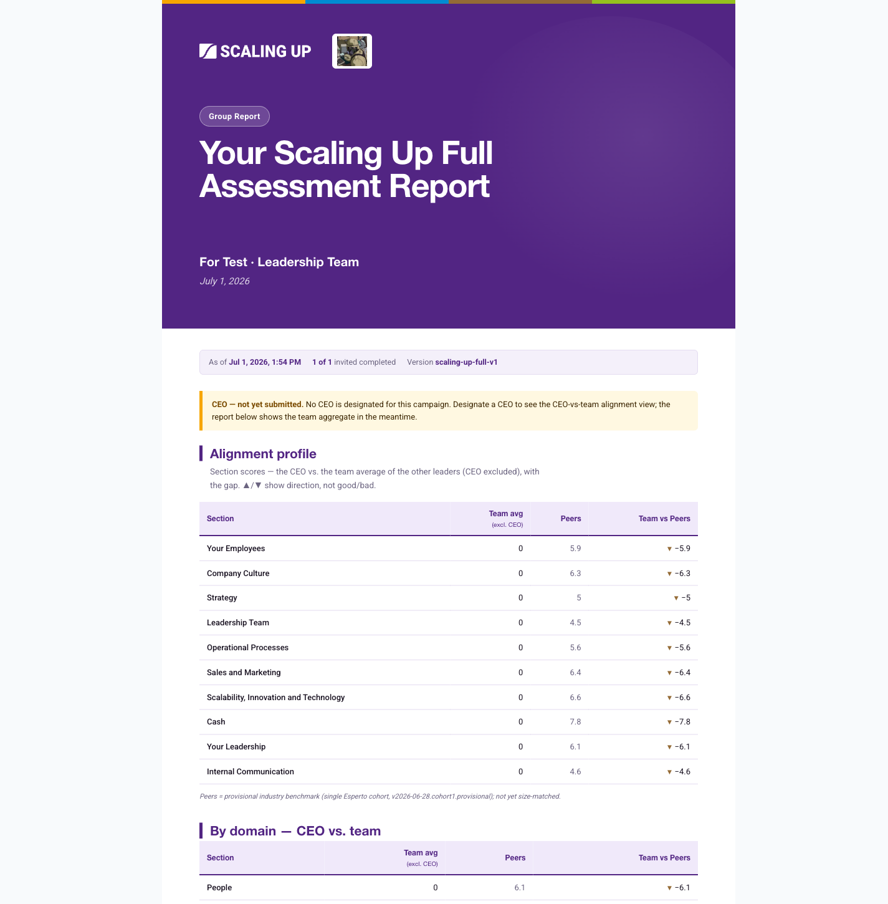
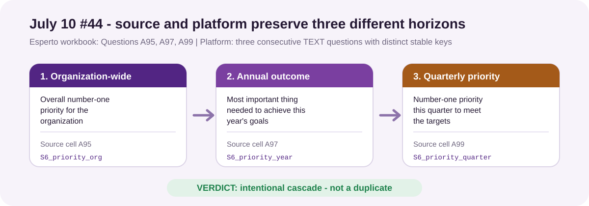

# July 10 Assessment Feedback - Approval-Ready Decision Packets

These packets preserve the bounded decisions and verification receipts behind
the [canonical closeout ledger](jul10-feedback-closeout.md).
They were reconciled against origin/main at
8dd9f1936fe85fcc8237c5bab05b2d2a8b879c09 on 2026-08-12. The #32 closeout
implementation adds source-backed question-level benchmark values and report
rendering; no template version, feature flag, customer data, or email is changed.

Gabriel may authorize the recommendations below. Publishing a template version,
changing production benchmark data, enabling a flag, or sending an email still
requires a separate explicit production authorization.

The copy packets use this source-backed approval visual. It transcribes the
current seed wording and proposed disposition; it is intentionally not presented
as a live application screenshot.

## #32 Scaling Up Full industry benchmarking

**Exact ask.** “Missing industry benchmarking (answers vs industry standards)
from the Esperto version. Discuss universal vs report-specific.” The original
row names Scaling Up Full; it does not require a universal benchmark subsystem
or a new raw cohort-data contract before this row can close.

**Decision received.** Gabriel selected **Scaling Up Full only**. That resolves
the universal-versus-report-specific question without widening the row to other
assessment families.

**Source and implementation proof.** Jeff's supplied [Esperto Scaling Up Full
group report](../../From%20Jeff/APP_scaling%20up%20assessemnt/APP_scaling%20up%20assessemnt/ScalingUp_group_report_John%20CEOExec_2026-05-01T08_26_20-04_00.pdf)
shows a Peers column on page 4 and describes peers as comparable-size growth
companies. Its answer pages provide Q01–Q45 and Q56–Q61; the supplied [CEO Full
report](../../From%20Jeff/APP_scaling%20up%20assessemnt/APP_scaling%20up%20assessemnt/ScalingUp_CEO_Full_report_John%20CEOExec_2026-05-01T08_24_56-04_00.pdf)
provides the CEO-only Q46–Q55 on printed pages 22–23. The durable [source
extract](../specs/v7.6/18j-su-full-source-extract.md)
records the source values and the important limitation that the available
sample represents one matched Esperto cohort, not a universal norm. Current
[Scaling Up Full benchmark data](../../src/src/lib/assessments/su-full-benchmarks.ts)
therefore preserves those values as the versioned
`2026-08-12.cohort1.provisional` reference. The implementation binds the full
61-question benchmark key set to the canonical Scaling Up Full seed, attaches
Peers and both signed deviations at the model layer, fails closed on any key
mismatch, and renders a third Peers bar beside CEO and Team. It remains
alias-scoped to `scaling-up-full` and labels the source as a provisional single
Esperto cohort rather than claiming a size-matched universal industry standard.

**Existing Production proof.** The tracked screenshot above shows the already-live
aggregate Peers values, Team-vs-Peers differences, and the provisional
single-cohort footnote. The [Wave J launch
receipt](https://github.com/ChiefAI-Officer/Scaling-up-platform-v2/blob/8dd9f1936fe85fcc8237c5bab05b2d2a8b879c09/plans/CHANGELOG.md#L2305) records the live
campaign verification, published Scaling Up Full version, key-set match, and
enabled report gate. This screenshot predates the new question-level bars and is
not presented as their acceptance evidence.

**Disposition.** PARTIAL until the implementation is merged and a deployed
Scaling Up Full report visibly confirms the CEO/Team/Peers question bars. The
universal-versus-report-specific decision is resolved and no further product
decision is needed. Replacing the provisional reference with cohort-matched
norms or expanding comparisons to other assessments remains a separately
approved data/product enhancement.

## #41 LVA The leadership wording

**Exact ask.** Clarify what “The leadership” measures before rewording it.

**Current truth.** The phrase is a source-derived LVA factor distinct from
“Leadership team.” Its durable identity is S3_the_leadership and the same
semantic key drives the obstacle option and explanatory follow-up in
[seed-lva-assessment.ts](../../src/prisma/seed-lva-assessment.ts). The
[historical crosswalk](../../src/src/lib/assessments/esperto-import/crosswalks/lva.ts)
depends on its factor position.

**Recommendation.** Hold until the content owner chooses whether this means the
leadership function, senior leaders' behavior, or another construct. Do not
silently substitute “Leadership effectiveness,” because that invents meaning
next to an already separate “Leadership team” factor.

**Compatibility.** Retain S3_the_leadership only if the approved change is a
semantic clarification. A different construct requires a new stable key and an
explicit import/report mapping decision.

**Acceptance.** A new draft version uses the approved wording in the matrix,
obstacle option, and associated follow-up while historical answers retain the
correct meaning.

**Approval sentence.** I approve holding #41 until I confirm what “The
leadership” measures; once confirmed, make a wording-only new-version change
that keeps S3_the_leadership unless the meaning is materially different.

## #42 LVA Growth Financing wording

**Exact ask.** Clarify whether “Growth Financing” means the ability to obtain
financing, then reword it.

**Current truth.** Gabriel authorized using `jcbdelo26` to complete this row on
2026-08-05. PR [#304](https://github.com/ChiefAI-Officer/Scaling-up-platform-v2/pull/304)
squash-merged as `f02d85f2`. Production LVA v4
(`cmrn4n7dr0004hd4v6hi01as1`) was updated through the authenticated admin
editor and published at `2026-08-05T10:02:52.008Z`; the audit actor is
`jcbdelossantos.va@gmail.com`. The active version stores the approved wording
in the rating factor, obstacle option, and derived explanation while retaining
S3_growth_financing, growth_financing, and the locked Esperto factor position.
Historical campaigns remain pinned to their original versions, and report
rendering accepts both old and new survey labels.

**Approved disposition.** Use **Access to financing for growth** in both the
rating matrix and obstacle option. Do not change the scale, order, or associated
follow-up scope.

**Compatibility.** Retain S3_growth_financing, growth_financing, and the
historical crosswalk position. This is a wording-only new-version change with no
schema or import conversion.

**Acceptance.** Targeted seed, report-compatibility, and golden-import tests
prove the approved wording, stable keys, historical label handling, and factor
position. Production database verification confirms active v4 content hash
`9d2f9052b0a358b91659aa8e6decdcecb16911e3cc5a8b9bb953d7e0572f17ac`
with the three approved labels. Authenticated respondent-preview review showed
clean rendering in the rating and obstacle surfaces with zero publish blockers;
the two advisories are the intentional questionless Welcome and Completion
sections. `/api/health` returned healthy database and safe auth posture.

**Disposition.** DONE. No response was submitted and no email, flag, schema,
migration, benchmark, or unrelated Production state was changed.

## #44 LVA priority triplet

**Exact ask.** Determine whether “What is in your opinion the most important
thing to achieve this year's goals?” duplicates the immediately preceding
priority question.

**Source comparison.** [Jeff's supplied Esperto workbook](../../From%20Jeff/APP_scaling%20up%20assessemnt/APP_leadership%20vision%20alignment%20assessment/leadership%20visin%20alignment%20assement.xlsx)
contains the three prompts separately in the `Questions` sheet:
organization-wide priority at `A95`, the annual outcome at `A97`, and the
quarterly priority at `A99`. The three rows contain different example answers.
[Current platform content](../../src/prisma/seed-lva-assessment.ts#L646)
preserves the same order as `S6_priority_org`, `S6_priority_year`, and
`S6_priority_quarter`; the [Wave X golden crosswalk](../../src/src/__tests__/lib/assessments/esperto-import/crosswalk-golden.wave-x.test.ts#L194)
also maps them separately as Esperto `Q29`, `Q29a`, and `Q30`.

**Answer.** No. The middle prompt is not a duplicate of the preceding prompt.
The first asks for the organization's overall priority; the second asks for the
annual outcome needed to achieve this year's goals; the third asks for the
current quarter's priority. This is an intentional three-horizon cascade.

**Disposition.** DONE against the exact July 10 request to review the possible
duplicate. No wording, stable key, import mapping, template version, or
Production state changed. If clearer horizon-forward wording is wanted later,
that is a separate copy improvement requiring its own approval and published
LVA version; it does not reopen the duplicate determination.

## #45 LVA media wording

**Exact ask.** Identify Suzanne's concern with “What do the media write about
the company?” before changing it.

**Current truth.** This source-faithful free-text question uses stable key
S2_media, and the locked historical crosswalk maps the same source position.
The available artifacts provide no authoritative replacement.

**Recommendation.** Hold until Suzanne identifies whether the concern is
grammar, scope, relevance, or answer form. If it is grammar only, propose
**What is being said about the company in the media?** for confirmation. Do not
expand it to customer, employee, or social-media sentiment without approval.

**Compatibility.** Preserve S2_media for grammar-only clarification. A material
scope expansion requires a new key and mapping decision.

**Acceptance.** The approved label appears in a new draft with the correct
stable-key treatment and no change to unrelated questions or imports.

**Approval sentence.** I approve holding #45 until Suzanne confirms the
concern; if she confirms grammar-only wording, use “What is being said about the
company in the media?” in a new version while retaining S2_media.

## #47 QSP v2 invitation email

**Exact ask.** Add coach-logo space, mention the coach by name, revise the
invitation copy, and enlarge the begin button.

**Current truth.** The standard QSP v2 path already uses coach-forward copy,
passes a valid coach logo into the Scaling Up-first shell, and renders the larger
CTA through
[invitation-email.ts](../../src/src/lib/assessments/invitation-email.ts).
Campaign-level full-HTML overrides deliberately replace that shell and are a
separate compatibility mode. Existing tests prove the renderer contract, but a
current standard-path production smoke and final copy approval are absent.

**Recommended body copy.**

> Hi {{respondentFirstName}},
>
> You've been invited by {{coachName}} to complete the {{templateName}} for
> {{organizationName}}.
>
> It takes just a few minutes, and there are no right or wrong answers - your
> honest perspective is what makes the results useful. Your responses are
> confidential.
>
> Click the button below to begin.

**Compatibility.** Invitation copy is version content. Keep legacy full-HTML
replacement behavior until a separate migration is approved; no question key,
scoring, or import mapping changes.

**Acceptance.** On the standard renderer, representative desktop and mobile
email previews show the coach name, safe coach logo, approved text, and the
larger CTA. A separately authorized live smoke confirms delivery rendering.

**Approval sentence.** I approve closing #47 on the standard QSP v2 renderer
with the current coach-forward copy, coach-logo shell, and larger CTA after a
live smoke; legacy full-HTML override conversion remains separate.

## #57 and #58 LVA peer averages and report comparison

**Exact asks.** #57 requires authorable LVA question peer averages with a path
for future templates. #58 requires populated peer comparisons in both
individual and group LVA reports.

**Current truth.** Wave S implemented tested LVA QUESTION storage, atomic admin
authoring, keyed joins, and both report surfaces in PR #132 / 9220503f. A
historical four-value pilot succeeded and was then cleared. The latest retained
production receipt shows the capability effectively dark and cannot establish
approved populated rows. Rendering remains intentionally LVA-only.

**Recommendation.** Treat this as three explicit resumes: authorize restoring
Wave S, approve a provenance-backed real LVA peer dataset, then verify populated
individual and group reports. Decide future-template support one alias and
metric contract at a time; do not imply universal support from the current LVA
allowlist.

**Compatibility.** Preserve QUESTION metric keys and omit-empty behavior.
Missing values or a dark gate must show no fabricated comparison. GH #233's
read-only observability is evidence infrastructure, not feature activation.

**Acceptance.** An authorized production receipt establishes effective
availability; approved values are visible in authoring; the individual report
shows the peer section; the group report shows peer value and deviation; absent
values remain omitted.

**Approval sentence.** I approve a separately controlled Wave S restore for
LVA, followed by entry of the approved peer dataset and live verification of
both report surfaces; future-template enablement remains a separate decision.

## #75 Five Dysfunctions answer-driven output

**Exact ask.** Confirm whether the Five Dysfunctions assessment generates
findings/results from submitted answers. The original row is a direct status
question; it does not require separately authored Wave U finding rules.

**Verified answer.** Yes. The launched Five Dysfunctions assessment maps its 38
submitted answers into five domain averages: Trust, Conflict, Commitment,
Accountability, and Results. Each average deterministically selects Low,
Medium, or High interpretation guidance, and the scored report renders those
answer-driven domain results. The assessment was launched on 2026-06-10 through
PR #48, before the July 10 report.

**Evidence.** The source-owned scoring configuration defines the five domains,
their question membership, exact tier boundaries, and non-placeholder guidance
messages. The shared scoring engine computes `perDomain` averages from submitted
answers and resolves the matching tier. The scored screen and email renderers
consume that frozen result. Focused seed/schema tests guard the five-domain
mapping and all Low/Medium/High boundaries; the generic scoring and report tests
guard calculation and presentation.

**Disposition.** DONE against the exact July 10 status question. Bespoke Wave U
rules that emit additional findings beyond the existing domain interpretations
remain a separately scoped enhancement; they do not reopen this row.

## #84 SunHub eight-question quick quiz

**Exact ask.** Determine the build status of the SunHub “Scaling Up 4 Decisions
Quick Quiz,” an eight-question lead-magnet assessment with end feedback.

**Current truth.** The authoritative source package is the tracked
[SunHub workbook](../../From%20Jeff/APP_scaling%20up%20assessemnt/SunHub_ScalingUpQuiz/SU-Quiz.xlsx).
It contains eight ordered 0-10 questions, four feedback bands, source result
copy, source visuals, and three CTA destinations. The source-backed build now
exists as a separate `sunhub-quick-quiz` PUBLIC template with one question per
page and its own result presentation. Production template version 1 is
published and the `sunhub-quick-quiz` PUBLIC campaign is ACTIVE. A live
eight-answer submission scored 44/100, displayed the correct 25-49% feedback
and three source CTAs, and produced first-attempt SENT receipts for the taker
and Scaling Up team emails. The different 32-question, four-domain
assessment in
[seed-scaling-up-quick-assessment.ts](../../src/prisma/seed-scaling-up-quick-assessment.ts)
is unchanged.

**Recommendation.** No further #84 action is required. Treat later content,
branding, analytics, or import requests as separately scoped enhancements.

**Compatibility.** Use a new alias and fresh sunhub_* section/question keys.
Any legacy-result import needs its own discovered and locked crosswalk.

**Acceptance.** Complete. Production verification covered exactly eight
questions in source order, the 0-10 scale, a 44/100 score in the correct band,
the source feedback and three CTA destinations, desktop/mobile rendering, and
both delivery roles. The isolated alias and guarded exact-template operations
left the 32-question instrument unchanged.

**Approval status.** Gabriel authorized the bounded Production acceptance run.
The template was seeded as DRAFT, visually checked, published, activated as a
PUBLIC campaign, and accepted through one representative submission and its
screen/email receipts. Row #84 is DONE.

## Decision order

1. Complete Production visual acceptance for implemented #32 and received-email acceptance for #47.
2. Answer the content questions: #41 and #45. #44 is evidence-verified DONE.
3. #57/#58 are closed; after #32's live question-level receipt, treat any wider
   or cohort-matched benchmark work as separately approved follow-ons.
4. Handle #33 through its dedicated report-by-report matrix rather than this
   copy/data queue.
