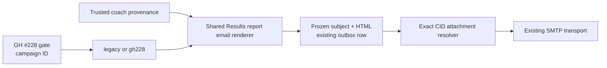

# GH #228 — Results Report Email Branding Design

- **Status:** Written design approved on 2026-08-03; visual mockup gate pending
- **Issue:** [GH #228](https://github.com/ChiefAI-Officer/Scaling-up-platform-v2/issues/228)
- **Claim:** [Tracker #261 claim](https://github.com/ChiefAI-Officer/Scaling-up-platform-v2/issues/261#issuecomment-5162184752)
- **Notion:** [Design Scaling Up / Coach chrome for emailed assessment results](https://app.notion.com/p/3b18c45dd82981dc80caf51e78c91808)

## Summary

Every Results report email will use one consistent,
email-safe brand hierarchy when GH #228 is enabled:

1. the actual Scaling Up mark is primary;
2. the trusted coach is an optional, subordinate `Coached by …` provenance
   byline; and
3. the existing report title, respondent identity, report content, calls to
   action, and delivery behavior remain unchanged.

The change is a pure renderer variant plus a deterministic inline Scaling Up
logo attachment. It is default-off, canaryable by exact campaign ID, and
killable. Disabled output remains byte-identical to the current renderer. The
design adds no schema or migration.

This document is design only. No product implementation is included.

## Current State

`buildReportEmailHtml` already renders a purple, four-color-striped report shell
for both scored and qualitative reports. Its cover uses the text `SCALING UP`,
not the actual logo image. Although `RespondentReport` already supports
`coachLogoUrl` and `coachName`, the email renderer does not consume them.

The shared renderer currently feeds three Results report emails:

- invited assessment `ASSESSMENT_RESULTS` to the respondent;
- public assessment `TAKER_COPY`; and
- public assessment `REFERRING_COACH`.

The SU-team public lead summary and invited `COACH_COMPLETION` notification are
short notifications, not complete reports, and do not use the renderer.

Invitation emails establish the relevant precedent: the Scaling Up logo is an
inline CID attachment, coach images remain optional HTTPS images, and missing
coach assets degrade without blocking delivery. On-screen reports establish
the approved hierarchy: Scaling Up first, followed by a subordinate coach
byline on the cover and footer.

## Product Decisions

### Results report email scope

GH #228 applies to all three Results report emails. It does not alter short
notifications or lead summaries.

### Brand hierarchy

The Scaling Up mark is always primary. Trusted coach identity appears below or
after it as provenance, never as a co-equal brand and never ahead of Scaling Up.

### Trusted coach provenance

- The canonical domain term for the whole image-plus-name unit is **Coach
  byline**.
- Invited reports use the campaign creator coach.
- Public attributed reports use the submission's frozen verified **Referring
  coach**, resolved through the existing active-coach referral guard at submit
  time (ADR-0028).
- The rendered coach name and image URL are a submission-time presentation
  snapshot. Once queued, later coach-profile edits do not change those bytes.
- An organization owner is never substituted when the trusted coach is absent.
- An unattributed public report is Scaling Up-only.

### Fallbacks

- Valid coach image plus name: show both.
- Missing or rejected image plus name: show the name only.
- No usable coach name, with or without an image: omit the coach block.
- No trusted coach: omit the coach block.

A usable name is therefore required for a Coach byline. The image is optional
supporting presentation and is never rendered alone.

### Scaling Up asset

Use the existing white Scaling Up PNG bytes as an inline attachment under a new,
versioned report-email CID. Do not use an external Scaling Up logo URL, a data
URI, or a newly designed asset.

### Kill semantics

The dedicated GH #228 kill switch is prospective: it returns newly rendered
Results report emails to the legacy variant. It does not recall, rewrite,
cancel, or strip branding from rows already queued. The existing global
`ASSESSMENT_SENDS_PAUSED` control contains queued delivery when necessary.

### Approval boundary

The invited Results Email approval hash continues to approve only the exact
admin-authored subject/body pair. Platform-controlled report chrome, rollout
state, and coach provenance remain outside that hash, consistent with the
operator-copy boundary in ADR-0027. Enabling GH #228 or editing a coach profile
therefore does not revoke an otherwise valid Results Email approval.

### Delivery-authorization boundary

A public referring coach is verified through the existing active-coach guard
when submission creates the Results report email. GH #228 does not add a second
active-status check at worker send time: the queued recipient and rendered
Coach byline remain frozen. Later on-screen report access continues to use its
current active-coach authorization gate under ADR-0028.

## Architecture

### Pure renderer variant

`buildReportEmailHtml` accepts an explicit variant:

```ts
type ReportEmailChrome = "legacy" | "gh228";
```

The argument defaults to `legacy`. The renderer remains pure and never reads
environment variables.

- `legacy` returns the current scored and qualitative bytes unchanged.
- `gh228` renders the approved cover and footer and references the versioned
  Scaling Up CID.

Both report anatomies use one shared email-chrome builder so their cover and
footer cannot drift.

### Runtime gate

A dedicated pure flag helper decides the variant once per render:

- `WAVE_228_REPORT_EMAIL_CHROME_KILL` hard-overrides all other levers off.
- `WAVE_228_REPORT_EMAIL_CHROME_ENABLED` enables the variant globally.
- `WAVE_228_REPORT_EMAIL_CHROME_CANARY` is a comma/space-separated allowlist of
  exact campaign IDs.

Unset or unrecognized values are off. The renderer receives only the resolved
variant.

### Inline attachment

The branded HTML references a new exact CID such as
`cid:su-report-logo-v1`. The bytes reuse the existing generated
`SU_LOGO_PNG`.

A small pure helper maps frozen HTML to SMTP attachments by matching the exact
platform-owned attribute token (for example,
`src="cid:su-report-logo-v1"`):

- exact report-logo `src` token present: return the one inline PNG attachment;
- exact token absent: return no attachment.

That exact versioned `src` token is the complete attachment manifest for GH
#228. A bare CID string in visible or escaped copy does not match. The worker
does not infer from recipient role or email type, and no attachment metadata is
added to the outbox row.

The assessment outbox worker passes that result to the existing SMTP transport.
It does not change the outbox schema or persist duplicate static image bytes.
The versioned CID prevents accidental attachment behavior for unrelated HTML.



## Presentation Contract

### Cover

The four-color stripe remains unchanged. Inside the current purple cover:

1. render the actual white Scaling Up logo at the existing primary-mark scale;
2. render the optional coach block beneath it with a 12px separation;
3. retain the assessment title; and
4. retain respondent and submission metadata in their current order.

The coach block uses table-compatible markup and fixed maximum dimensions. The
cover coach image is capped consistently with the existing invitation-email
precedent so an oversized source image cannot expand the 640px layout. Visible
copy is exactly `Coached by {name}`.

### Footer

Replace the current text-only footer with a compact purple brand row whose
semantic and DOM order matches the on-screen report:

1. Scaling Up mark;
2. optional coach byline;
3. submission date; and
4. `Generated by Scaling Up Platform`.

The footer reuses the same Scaling Up CID and trusted coach provenance. It does
not introduce a second identity lookup.

### Email-client constraints

- Inline styles and presentation tables only.
- No external stylesheet, `@import`, flexbox, or grid.
- No new subject, introduction, conclusion, CTA, or report-content copy.
- Every coach name and URL is escaped at its HTML boundary.
- Coach image sources pass through `safeImageSrc`.
- When visible text names the coach, the adjacent image is decorative with an
  empty alt value to prevent duplicate screen-reader announcements.

## Data Flow

### Invited reports

The invited submit path already places the creator coach image and name on
`RespondentReport`. It resolves the GH #228 variant from the campaign ID and
passes the variant to the report renderer.

The Phase-1/Phase-2 results fingerprint adds:

- the resolved chrome variant; and
- creator-coach identity fields used by the branded bytes.

When the variant is `legacy`, the coach tuple normalizes to `null` so coach
profile edits cannot create a new legacy-only stale-row condition. When the
variant is `gh228`, a creator-coach name, image, or identity change during the
lock window drops only the stale prepared results row. The submission still
commits under the existing contract.

The results-email approval hash remains the canonical hash of only the exact
admin-authored subject/body pair. Generated report chrome does not redefine
that approval boundary.

### Public reports

The existing active referring-coach lookup widens its selected and returned
shape to include `profileImage`, `firstName`, and `lastName`. Certification,
expiry, normalization, and open-relay checks remain unchanged.

The verified coach populates `coachLogoUrl`, `coachName`, and the existing
referring-coach email on `RespondentReport`. Unattributed or rejected referrals
populate none of those coach fields.

The existing concurrent-coach-deletion recovery rebuilds the taker payload with
no coach provenance. The rebuilt report therefore contains Scaling Up chrome
only. Same-mailbox suppression continues to retain a cancelled coach-role row
and does not send a redundant second report.

Once a referring-coach row exists, the worker sends its frozen recipient and
HTML without re-resolving coach status or profile fields. This preserves
existing delivery behavior; it does not weaken the separate current-status gate
for interactive report viewing.

### Frozen rows and rollout

Existing outbox rows are never rewritten:

- rows rendered before enablement retain legacy HTML;
- rows rendered under the branded variant retain branded HTML and its CID;
- each row retains the coach name and image URL rendered at submission time,
  even if that coach's profile later changes;
- the worker derives only the deterministic attachment required by the frozen
  body.

The dedicated kill returns newly rendered reports to legacy immediately.
`ASSESSMENT_SENDS_PAUSED` remains the immediate containment control for branded
rows already enqueued. This avoids mutating frozen bodies or changing lease and
retry semantics. Disabling GH #228 alone therefore does not recall, cancel, or
restyle an already-queued email.

## Failure, Security, and Privacy

- No coach image is fetched by the application.
- Attachment resolution recognizes only the exact platform-owned report-logo
  `src` token. Report fields and admin-authored introduction copy remain
  escape-first, so they cannot inject that HTML reference.
- Missing or rejected coach image data degrades without failing rendering.
- The static Scaling Up attachment is prepared before provider handoff. An
  unexpected attachment-preparation failure is a send failure and follows the
  existing retry/dead-letter path; the worker must not knowingly send branded
  HTML without its CID attachment.
- The qualitative renderer keeps its current never-throw fallback and
  `renderError` signal.
- Observability may record only the chrome variant and a PII-free state such as
  `none`, `name-only`, or `image-and-name`.
- Logs must not contain coach names, coach email addresses, or raw image URLs.
- `safeImageSrc` remains HTTPS-only but does not constrain hosts. Enabling coach
  images can therefore cause an email client to request an arbitrary HTTPS
  host. GH #228 does not add a proxy, allowlist, download, or embedding policy;
  that policy work remains outside this issue.
- The change does not alter recipients, report authorization, scoring, stored
  answers, approval hashing, send leases, retries, provider handoff, or delivery
  completion.

## Verification

### Flags

- Default-off behavior.
- Exact campaign-ID canary matching.
- Global enable.
- Kill precedence over global and canary.
- Dedicated-kill changes affect new renders only; queued rows remain unchanged.
- Global send pause contains queued branded rows.

### Renderer

- Byte-identical legacy output for scored and qualitative reports under both
  recipient roles.
- Branded cover and footer for scored and qualitative reports.
- Scaling Up-before-coach DOM order in both locations.
- Image-and-name, name-only, invalid-image, blank-name-with-image, and no-coach
  states.
- HTML escaping and image-size constraints.
- No external CSS, flexbox, or grid.

### Call sites and provenance

- Invited respondent results receive branded chrome only when enabled.
- Public taker and public referring-coach Results report emails receive the same
  chrome.
- SU-team lead summaries and short coach-completion emails remain unchanged.
- Active verified public referrals supply coach provenance.
- Invalid, inactive, expired, missing, or concurrently deleted public coaches
  produce Scaling Up-only reports.
- A coach verified when the row is created remains the frozen recipient and
  byline if later deactivated before send; no new send-time lookup occurs.
- Same-mailbox coach suppression remains unchanged.

### Consistency and delivery

- Invited name, image, identity, or chrome-variant drift drops only the stale
  results row while the submission commits.
- Legacy mode ignores irrelevant coach-profile drift.
- Queued branded rows retain their rendered coach name and image URL after
  subsequent profile edits.
- Exact report-logo `src` token adds exactly one inline attachment.
- Recipient role, email type, and similar unrelated HTML do not trigger the
  attachment without the exact token.
- A bare CID string in escaped report or introduction copy does not trigger an
  attachment.
- Legacy and unrelated HTML add no attachment.
- Attachment or SMTP failure uses existing retry and terminal-state behavior.
- The results subject/body approval hash remains unchanged.
- Chrome-flag and coach-profile changes do not change or revoke an existing
  subject/body approval.

### Visual review gate

Written-design approval may precede visual work. The first implementation-plan
deliverable must then be isolated email mockups reviewed and approved for:

- 640px desktop width;
- narrow/mobile width;
- Scaling Up plus coach image and name;
- blocked remote coach image with visible name;
- name-only coach provenance;
- Scaling Up-only fallback; and
- representative scored and qualitative bodies.

The mockup must use the proposed email-safe table structure and existing assets.
It is a design artifact, not product scaffolding. No product code or
behavior-changing work can begin until this separate visual gate is approved.

## Acceptance Criteria

1. With all GH #228 flags off, every existing report-email path remains
   byte-identical and sends no new attachment.
2. With GH #228 enabled, every Results report email uses the actual embedded
   Scaling Up mark in the cover and footer.
3. Trusted coach provenance follows the approved invited/public identity rules
   and never falls back to the organization owner; its presentation snapshot
   remains frozen in each queued row.
4. Missing or rejected coach data degrades without breaking the report, and an
   image is never shown without a usable coach name.
5. Short notifications, subjects, admin introductions, report content, CTAs,
   recipients, scoring, approval hashes, outbox schema, leases, retries, and
   provider semantics remain unchanged.
6. The new variant can be canaried, globally enabled, stopped for new renders
   with its dedicated kill, and contained for queued sends with the existing
   global send pause.
7. Automated tests and the pre-implementation visual review gate pass before
   implementation proceeds.

## Explicit Exclusions

- GH #220 campaign full-HTML precedence.
- GH #233 flag visibility and production-state investigation.
- GH #256 coach-logo host policy.
- GH #257 outbox reconciliation or production backfill.
- Coach-notification redesign.
- SU-team lead-summary redesign.
- New report copy, scoring, privacy authorization, recipients, schema, or
  migrations.
- Production flag changes, email sends, or customer-data writes.
